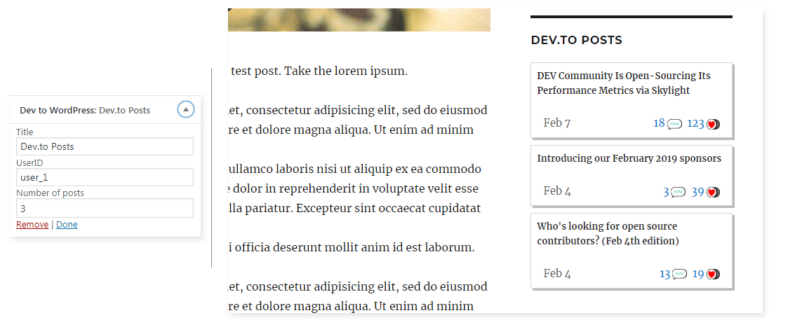

# dev-to-wordpress
A wordpress plugin to show your DEV.to posts in a widget.

## Usage

Clone the repo and copy it to your WP plugins folder, then activate it.

### Notes
> You can find your user_id looking in the HTML source code of your profile page and searching for "user_"

> dev.to doesn't have an oficial API, so this plugin is unstable.
