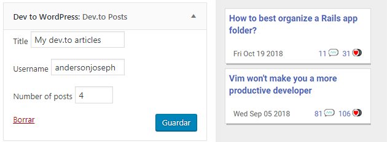
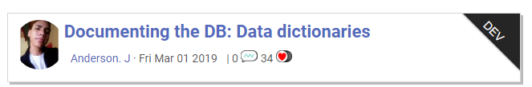

# dev-to-wordpress
A wordpress plugin to show your DEV.to posts.

---

## Usage

### Widget

The sidebar widget display the latest articles of the user given. You can use this widget in any widget area of your theme.

### Shortcode

Use shortcodes to display a particular post.
Syntax:

    [devtowordpres post="https://dev.to/username/post-url-example"] 

